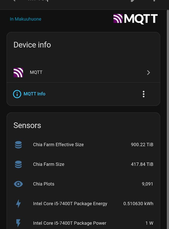

# mqtt-sensors

Long-lived processes that publish host stats to MQTT with Home Assistant discovery. Absolute minimum. One process per sensor, one source held open for the life of that process.



## Adding a sensor

Copy the shape of `cpu_package_power.py` or `nvidia_gpu_power.py`. Do not add a framework.

1. New script in the repo root. Import from `mqtt_common` only.
2. `get_hostname()` + `make_device()` so unique_ids and the HA device include the host.
3. Hold one source open: a sysfs fd, or one subprocess with a native loop (`nvidia-smi --loop=1`). Never spawn per sample.
4. Connect with LWT on an availability topic. On connect: retained discovery + `online`. On exit: `offline`.
5. ~1 s cadence. Publish retained state. Power is `%.1f` W. If you also publish energy, integrate in RAM (`power * dt / 3600` → kWh) with `state_class=total_increasing`. HA expects that counter to start at 0 when the process starts; do not persist it.
6. Optional `foo.service` stub: `ExecStart`, `WorkingDirectory`, `WantedBy=default.target`. Edit the path on the host. Nothing else.

Reuse `make_power_discovery` / `make_energy_discovery`, or `make_sensor_discovery` for other units. Do not grow `mqtt_common.py` unless several sensors need the same helper.

### Do not

- Comments
- Extra error handling, logging, retries, reconnect wrappers, fake data
- CLI flags, extra config files, new dependencies, tests, types, Docker, CI
- A Sensor base class
- systemd `Restart=`, `[Unit]` filler, hardening

Assume RAPL, `nvidia-smi`, the broker, and `.env` work.

## Existing collectors

| script | source (held open) | objects |
|---|---|---|
| `cpu_package_power.py` | `/sys/class/powercap/intel-rapl:*/energy_uj` (first `package*`) | `cpu_package_power_<host>` + `_energy` |
| `nvidia_gpu_power.py` | one `nvidia-smi --query-gpu=index,name,power.draw --loop=1` | `gpuN_power_<host>`, `gpuN_energy_<host>` per GPU |

Topics under `$MQTT_PREFIX` (default `homeassistant`): `sensor/<object>/{config,state,availability}`. GPU availability is shared: `sensor/gpu_power_<host>/availability`. HA device: `linux_host_<hostname>`.

## Config

`.env` in the working directory, or the environment:

```
MQTT_HOST=localhost
MQTT_PORT=1883
MQTT_USER=
MQTT_PASS=
MQTT_PREFIX=homeassistant
```

Python 3 + `paho-mqtt`. Working directory is the repo (dotenv is `.env` here). systemd stubs still say `/root/mqtt-sensors`.
