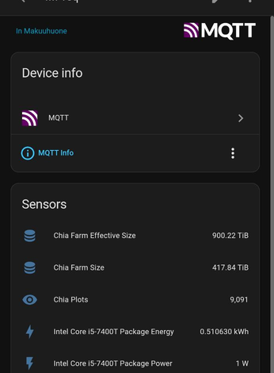
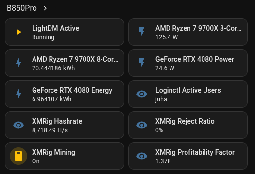

# mqtt-sensors

Long-lived root processes that publish host stats to MQTT with Home Assistant discovery. One process per collector; each holds open a source or polls one in-process. No framework, no `requirements.txt`, no pip.

Collectors on a host share one HA device named after the hostname (`linux_host_<hostname>`), except device-scoped power-supply batteries, which get their own HA device linked with `via_device`. Screenshots: farmer host `M710q` (CPU RAPL + farm size), and miner host `B850Pro` (package/GPU power, XMRig hashrate/switch/reject + profitability factor). Recompute and harvester processing times land on whichever machine actually runs those processes.





[SECURITY.md](SECURITY.md) is the supply-chain / root policy. [CODE_OF_CONDUCT.md](CODE_OF_CONDUCT.md) is fail-fast / minimalism. [AGENT.md](AGENT.md) is the contract for coding agents adding a sensor — same role as an `AGENTS.md`. You can ignore it. Windows CPU/GPU copies of the Linux power collectors live in [windows/](windows/README.md).

## Collectors

| collector | what HA shows | source (held open) |
|---|---|---|
| `cpu_package_power.py` | package power (W) and energy (kWh, RAM only, resets on start) | RAPL `energy_uj` fd |
| `nvidia_gpu_power.py` | per-GPU power and energy | one `nvidia-smi --loop=1` |
| `windows/cpu_package_power.py` | package power (W) and energy (kWh, RAM only) | LibreHardwareMonitor WMI `CPU Package` via one PowerShell loop |
| `windows/nvidia_gpu_power.py` | per-GPU power and energy | one `nvidia-smi --loop=1` (no `select`) |
| `chia_farm_size.py` | plots, on-disk TiB, effective TiB, estimated netspace EiB, ETA to win (s) | farmer `:8559` + full node `:8555` TLS |
| `chia_recompute_server_processing_time.py` | recompute processing time (s, full precision, display 1 decimal) | `journalctl -u chia_recompute_server -f` |
| `chia_harvester_processing_time.py` | harvester processing time (s, full precision, display 1 decimal) and plot count | uid 1000 `debug.log` fd, reopen on daily rotate |
| `loginctl_active_users.py` | comma-separated users with `active` or `online` logind sessions | `/run/systemd/users` (what `loginctl` reads; no spawn) |
| `lightdm_active.py` | switch: LightDM unit running; start/stop only with `LIGHTDM_SWITCH_MODE=control` | `/sys/fs/cgroup/system.slice/lightdm.service` (no `systemctl` to read state) |
| `hwmon_drive_temperature.py` | per-drive temperature (°C), SATA incl. USB via SAT (`drivetemp`) and NVMe | `/sys/class/hwmon` polled every 60 s (`DRIVE_TEMPERATURE_INTERVAL`); `temp1_input` fd held while the node exists |
| `power_supply_battery.py` | per-battery capacity (%) | `/sys/class/power_supply` polled each second; `capacity` fd held while the node exists |
| `xmrig_status.py` | hashrate (H/s, 60s), reject ratio (%), mining switch, profitability factor (revenue/cost) | XMRig HTTP + MQTT inputs; remembers hashrate/W while paused |
| `support/xmr_eur_price.py` | XMR/EUR spot (EUR) | held HTTPS to Kraken public ticker, 60 s |
| `support/xmr_network.py` | Monero difficulty, network hashrate (H/s), block reward (XMR), XMR/H/s/day | held HTTPS to xmrchain.net, 60 s |

Run only the collectors that apply. GPU is a no-op without `nvidia-smi`. Farm needs a local farmer and full node. Recompute needs `chia_recompute_server` in the journal. Harvester follows `plots were eligible for farming … Time: N s. Total N plots` in `debug.log` (via `chia_root()`). Chia paths are uid 1000's `.chia/mainnet`, never `/root` and never a username. Power supply batteries are any sysfs node with `type=Battery` and a `capacity` file (Logitech `hidpp_battery_*`, laptop `BAT*`, and the like). The collector rescans that class dir each second so plug/unplug is picked up without a restart, and clears retained discovery when a node disappears. `scope=System` (laptop/UPS) stays on the host HA device; other scopes get their own HA device via the host so a mouse battery does not claim the host device battery badge. XMRig needs its HTTP API on localhost (`XMRIG_HOST`/`XMRIG_PORT`/`XMRIG_TOKEN` in `.env`); the mining switch requires `http.restricted=false` (XMRig is read-only or full write — there is no pause-only ACL). Reject ratio is `(shares_total - shares_good) / shares_total`. Without a spot €/kWh source, `xmrig_status` stays at basic mining stats. Default spot source is Home Assistant entity `sensor.porssisahko_electricity_price` (override with `HA_ELECTRICITY_ENTITY`) when `HA_TOKEN` is set (`HA_URL` defaults to `http://127.0.0.1:8123`, polled every 60 s). Alternatives: `ELECTRICITY_EUR_PER_KWH_TOPIC` (MQTT) or fixed `ELECTRICITY_EUR_PER_KWH`. It also waits for retained MQTT from package power, `xmr_per_hs_day`, and XMR/EUR before publishing the factor. Factor is `revenue/cost` (1.0 ≈ break-even). Publish-only — no default automation. While paused, last mining hashrate and package watts stay in RAM. `support/` holds helpers that are not host metrics (global MQTT object ids, no hostname): `xmr_eur_price.py` publishes Kraken’s XMR/EUR last trade; `xmr_network.py` publishes Monero difficulty, network hashrate, last-block reward, and XMR per H/s per day (`reward * 86400 / difficulty`) for hashrate profitability. Expected XMR/day ≈ local hashrate × that rate.

Energy is `total_increasing` kWh integrated in RAM; HA expects it to start at 0. ETA is `(netspace / effective) * 18.75`. Recompute work arrives in 10 s bursts; 0.2 s–5 s is normal — do not average. Harvester samples once per signage point (~every 9 s); a gap or a time climbing toward the signage window is the error signal.

Topics: `$MQTT_PREFIX/sensor/<object>/{config,state}` (default prefix `homeassistant`). Binary sensors use `binary_sensor/<object>/…`. Availability is per collector: `gpu_power_<host>`, `chia_farm_<host>`, `chia_recompute_server_<host>`, `chia_harvester_<host>`, `loginctl_<host>`, `lightdm_<host>`, `power_supply_<host>`, `hwmon_drive_temperature_<host>`, `xmrig_<host>`, `xmr_eur_<host>`, `xmr_network_<host>`. Switches use `$MQTT_PREFIX/switch/<object>/{config,state,set}`.

## loginctl active users

`loginctl_active_users.py` does not run `loginctl`. It lists `/run/systemd/users` (numeric files logind already writes), keeps names whose `STATE` is `active` or `online`, sorts them, and publishes a comma-separated string. Lingering with no session is omitted. Unique by username: a second session for the same user does not change the reading.

sshfs/sftp goes through PAM and `pam_systemd`, so a mount account becomes `online` and shows up unless you skip that module for those users. Interactive logins with a seat or pts are left alone.

Dedicated mount group, no TTY, no logind session:

```
groupadd --system sshfs
usermod -aG sshfs mountuser
```

`/etc/ssh/sshd_config.d/sshfs.conf`:

```
Match Group sshfs
    ForceCommand internal-sftp
    PermitTTY no
    AllowTcpForwarding no
    X11Forwarding no
```

Immediately above `pam_systemd.so` in `/etc/pam.d/common-session` (or the file that actually loads it):

```
session [success=1 default=ignore] pam_succeed_if.so quiet user ingroup sshfs
```

`success=1` skips the next line (`pam_systemd`) for that group only. Do not put that skip in front of `@include common-session` — it would skip the whole include. `pam-auth-update` can rewrite `common-session`; re-check the skip after it runs. Then `sshd -t` and reload sshd.

If you sshfs as a user who is already on a seat, they were already in the list; the mount does not add a new name.

## LightDM switch

`lightdm_active.py` publishes a HA `switch` (`switch/lightdm_active_<host>/{config,state,set}`). State is the `lightdm.service` cgroup dir existing, checked each second. On connect it clears the retained discovery and state of the old `binary_sensor/lightdm_active_<host>` so HA drops that entity.

`LIGHTDM_SWITCH_MODE` in `.env`:

- `read_only` (default, also when unset or empty): HA requires a `command_topic`, so the switch has one, but commands are ignored (printed) and the real state is re-published, so the toggle snaps back.
- `control`: `ON` runs `systemctl start lightdm.service`, `OFF` runs `systemctl stop lightdm.service`, prints the action and exit code, then re-publishes the real state. The collector runs as root, so no sudoers or polkit rule is needed. `OFF` ends any graphical session on that seat.

Any other value exits.

## Drive temperature

`hwmon_drive_temperature.py` does not run `smartctl` or anything else. It reads `temp1_input` (millidegrees C) from every `/sys/class/hwmon/hwmon*` whose `name` is `drivetemp` (SATA, also behind SAS HBAs and USB bridges) or `nvme`, and publishes one `°C` / `temperature` sensor per drive on the host HA device. The drive comes from the hwmon `device` link. For `drivetemp` the id is the first of: the disk's own ATA serial (and full ATA model) from `vpd_pg89` (the ATA IDENTIFY data drivetemp itself requires), the SCSI `serial` / `vpd_pg80`, `wwid`, then for USB the enclosure's `idVendor` + `idProduct` + `serial` + LUN. A drive with none of these is skipped with one printed line; `sdX` is never used. NVMe uses the controller's `model` + `serial`. Object and unique_id are `hwmon_drive_temperature_<id>_<host>`, so they survive `sdX` / `nvmeN` reshuffles. USB drives get ` (USB)` in the HA name. The class dir is rescanned each sample and each hwmon's `device` link re-checked, so a new drive gets discovery, a vanished one has its retained discovery cleared, and a reused `hwmonN` number is treated as a new drive. A failed read (drive asleep, `ENODATA`) skips that sample. With no `drivetemp` or `nvme` hwmon at start it exits.

NVMe needs nothing. SATA needs the `drivetemp` module:

```
modprobe drivetemp
echo drivetemp > /etc/modules-load.d/drivetemp.conf
```

Standby: the kernel docs ([drivetemp](https://docs.kernel.org/hwmon/drivetemp.html), usage note) say reading the temperature may reset the spin-down timer on some drives (seen on WD120EFAX; `hddtemp`/`smartd` do the same). On that drive a read in standby still works and does not spin it up; other drives are unknown. The workaround is to read at intervals longer than twice the spin-down time, otherwise affected drives never spin down. Default is 60 s; set `DRIVE_TEMPERATURE_INTERVAL` (seconds) above twice your spin-down time if drives should sleep.

### USB drives

`drivetemp` binds to any SCSI disk whose SAT layer supplies VPD page 0x89 (ATA Information) with SATA IDENTIFY data, then reads the temperature with ATA pass-through (`ATA_16`, SCT status or SMART) — `drivetemp_identify_sata()` in [drivers/hwmon/drivetemp.c](https://github.com/torvalds/linux/blob/master/drivers/hwmon/drivetemp.c). So a USB-SATA bridge works when:

- it is on `uas`. `usb-storage` (BOT) sets `skip_vpd_pages` ([scsiglue.c](https://github.com/torvalds/linux/blob/master/drivers/usb/storage/scsiglue.c), "Some devices don't handle VPD pages correctly"), so page 0x89 is never read and drivetemp does not attach. The kernel skips it because some bridges crash on VPD; forcing it is not covered here.
- the bridge implements SAT page 0x89 and passes `ATA_16` through. Bridges with the `NO_ATA_1X` quirk (`t` in `usb-storage.quirks`; ADATA CH94, Initio INIC-3069, PNY Elite, VIA VL711 in [unusual_uas.h](https://github.com/torvalds/linux/blob/master/drivers/usb/storage/unusual_uas.h)) have pass-through rejected by the kernel, so no hwmon.

If `drivetemp` is loaded and there is no `drivetemp` hwmon for a USB disk, that bridge does not do SAT pass-through under Linux; nothing in this repo can fix it. Adding the `u` (ignore UAS) quirk makes it worse, not better.

USB-NVMe enclosures (JMicron JMS583, Realtek RTL9210, ASMedia ASM236x) show up as SCSI disks, not NVMe, so there is no `nvme` hwmon. They also are not SATA, so `drivetemp` finds no SATA IDENTIFY and does not bind. `smartctl` reaches them only with vendor-specific pass-through (`-d sntjmicron`, `-d sntrealtek`, `-d sntasmedia`; e.g. `sntrealtek` arrived in smartmontools [7.2](https://github.com/smartmontools/smartmontools/releases/tag/RELEASE_7_2)), not SAT. Expect no temperature. Dual SATA/NVMe enclosures with a SATA M.2 inside behave like a USB-SATA bridge.

No `smartctl -d sat` fallback: it would be a subprocess per sample running as root, and a new package, which AGENT.md and SECURITY.md rule out. It also sends the same SAT pass-through `drivetemp` uses, so a bridge that blocks one blocks the other. The USB-NVMe vendor pass-through is the only real gap.

## Run

As root, from `/root/mqtt-sensors`. Distro packages only: `python3` and `python3-paho-mqtt`.

`.env` in the working directory, or the environment:

```
MQTT_HOST=localhost
MQTT_PORT=1883
MQTT_USER=
MQTT_PASS=
MQTT_PREFIX=homeassistant
XMRIG_HOST=127.0.0.1
XMRIG_PORT=44444
XMRIG_TOKEN=
HA_URL=http://127.0.0.1:8123
HA_TOKEN=
HA_ELECTRICITY_ENTITY=sensor.porssisahko_electricity_price
ELECTRICITY_EUR_PER_KWH_TOPIC=
ELECTRICITY_EUR_PER_KWH=
LIGHTDM_SWITCH_MODE=read_only
DRIVE_TEMPERATURE_INTERVAL=60
```

Matching `*.service` stubs: `ExecStart`, `WorkingDirectory=/root/mqtt-sensors`, `Restart=on-failure`, `RestartSec=10`, `WantedBy=default.target`. Enable the ones you want as system units.
